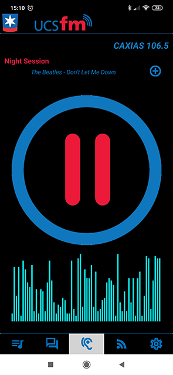

# Projeto Interface UCSfm

>
>Trabalho de Interface Humano Computador - FBI8002E (UCS - Universidade de Caxias do Sul)
>

**Instituição:** Universidade de Caxias do Sul 
**Curso:** Bacharelado em Ciência da Computação 
**Disciplina:** Trabalho de Interface Humano Computador 
**Professor:** Elisa Boff 
**Implementado em Delphi**

**Fórum: <a href="https://bomrafinha.dev/interface-humano-computador-interface-ucsfm/" target="_blank">https://bomrafinha.dev/interface-humano-computador-interface-ucsfm/</a>**  

***Clique na Imagem para visualizar o vídeo***  

### Objetivo do Trabalho

As principais telas do aplicativo incluindo todas as funcionalidades solicitadas. Justificar as escolhas relativas ao design a partir das características da interface: utilização de imagem, layout, orientação, navegação, etc.
Identificar quantas personas primárias devem ser descritas;

### Descrição:
Considere o cenário fictício: A Universidade de Caxias do Sul está lançando um novo aplicativo para a Rádio UCS FM. Este aplicativo para smartphones permite ouvir a programação ao vivo da rádio escolhida pelo usuário: Caxias 106.5, Bento Gonçalves 89.9 e Vacaria 106.1. A programação é a mesma nas 3 unidades, somente a publicidade é a da localidade.

O aplicativo é aberto ao público, não é necessário acessar com usuário e senha da universidade. O grupo deve decidir se desenvolverá os protótipos para iOS ou Android.

### O aplicativo UCSfm oferecerá recursos como:

- Ouvir a programação ao vivo da rádio;
- Visualizar as informações da música que está tocando e criar uma playlist com as músicas favoritas (esta playlist deve armazenar nome da música e cantor/banda);
- Acessar as principais notícias da rádio;
- Ter opção de acessar as páginas complementares da rádio (Facebook, site e Twitter).
- Fazer protótipos de interface para o aplicativo da UCSfm apresentando:

 

## Créditos 
[@bomrafinha](https://github.com/bomrafinha)

## [Licença](./LICENSE) 